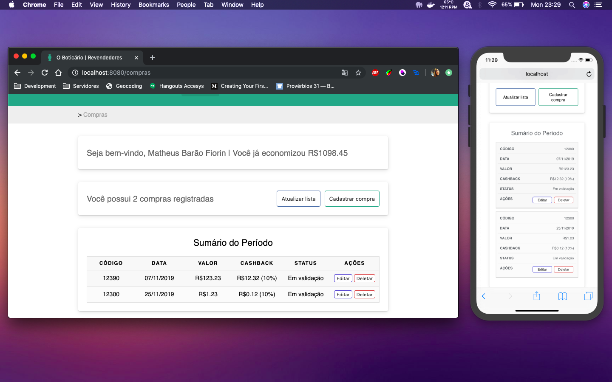

# Fullstack Developer Challenge - O Boticario

* Autor: Matheus Barão Fiorin
* Desafio: “Eu revendedor ‘O Boticário’ quero ter benefícios de acordo com o meu volume de vendas”.

Este projeto tem como seu foco a resolução do desafio proposto pelo Grupo Boticário, afim de demonstrar minhas capacidades perante ao mesmo.

## Antes de começar

**Importante! Verifique [aqui](dotenv.md) se os arquivos `.env` para a configuração de variáveis de ambiente estão devidamente colocados antes de continuar!**

### Back-End

Primeiro, você precisa ter uma instância MySQL pronta para uso (preferencialmente a versão `5.7.26`).

Assim que obtiver acesso, execute o arquivo `start.sql` da pasta `/db` dentro de sua instância.

Segundo, você precisa instalar o `node.js` na versão 12.x.x para funcionar corretamente. Caso não tenha, visite o [site de download oficial](http://nodejs.org/download/).

Assim que estiver tudo configurado, instale as dependencias do projeto rodando o seguinte comando no terminal (com a pasta `/backend` aberta no mesmo):

``` javascript
  npm install
```

Para executar os testes unitários, abra a pasta `/backend` no terminal e escolha entre:

* `npm test` - executa todos os testes;
* `npm run unit` - executa apenas testes de unidade;
* `npm run integration` - executa apenas o teste de integração.

Para ver a API em ação você precisa executar o comando `node app.js` da pasta `/backend`

> Você também pode importar minha coleção do Postman localizado na pasta `/backend/collection` para uma análise mais rápida.

> (Lembre-se que é necessário sempre passar o header `x-access-token` com um JWT válido para testar as rotas)

Checklist:
---

- [x] Utilizado NodeJS;
- [x] Utilizado MySQL;
- [x] Diferencial: Testes de unidade;
- [x] Diferencial: Teste de integração;
- [x] Diferencial: Autenticação por JWT;

Breve explicação:
---

Foi utilizado o conceito de `DRY - Don't Repeat Yourself` na confecção destas rotas afim de preservar a integridade de cada função que, por sua vez, faz com que cada função e/ou parte do back-end tenha uma tarefa bem delimitada e sem repetição de código. Cada rota tem seu arquivo separado afim de criar uma manutenção mais fácil, assim como foi utilizado o SequelizeORM para manutenção do banco de dados - com a grandiosa vantagem de aumentar a legibilidade do código e a performance das queries no banco.

### Front-End

Depois que o `node.js` estiver configurado, é hora de verificar se o cli do VueJS está devidamente instalado em sua máquina. Caso não esteja, verifique a instalação em no [site oficial](https://cli.vuejs.org/).

Após instalado, instale as dependências do `node.js` na pasta `/front-end` executando o comando `npm install` e, em seguida, estará pronto para usar.

Assim como descrito no `package.json`, temos dois comandos principais:

* `npm run serve` - executa o cli do VueJS para abrir um servidor local;
* `npm run build` - compila o código para a pasta `/dist` e está pronto para ser colocado em um servidor - como nginx.

Checklist:
---

- [x] Utilizado VueJS;
- [x] Diferencial: Não utilizado frameworks de UI;
- [x] Diferencial: Interface responsiva;

Breve explicação:
---

Aqui também foi utilizado o `DRY` com os interceptadores feitos no Axios, com a divisão de componentes e containers e com a prototipação do moment. Meu foco foi demonstrar minhas capacidades de criação da UI sem a necessidade de uma framework - por mais que eu utilize bootstrap a todo momento no meu dia-a-dia, assim como tentar mostrar um webpack com um bom nível de SEO, um pequeno começo de PWA - afim de funcionar offline.

Foi incorporado um estilo de design parecido com o que o `Grupo Boticário` oferece em seu [site](https://boticario.com.br/), porém, aplicando meus toques para ficar algo *único e minimalista*. O pacote `vue-sweetalert2` (para as exibições de erro) foi utilizado apenas para dar mais agilidade, tendo em vista que seu estilo encaixava com as diretrizes que criei ao fazer o sketch do projeto em uma folha de caderno.

### Screenshots:


> Todos os cinco testes com sucesso


> Tela de login




> Tela inicial, com quebra de tabela para card


> Adequação do modal


> Tela de registro
